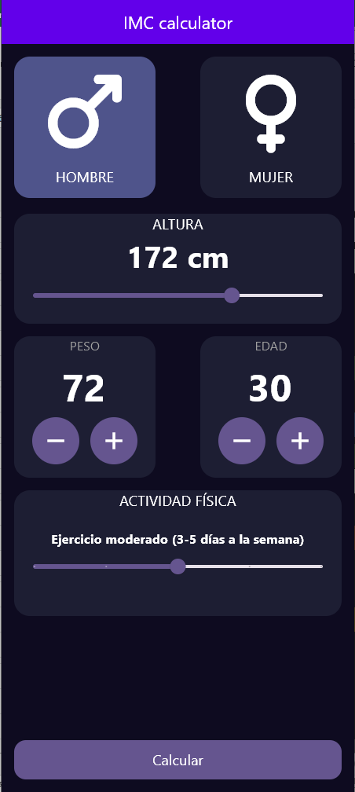
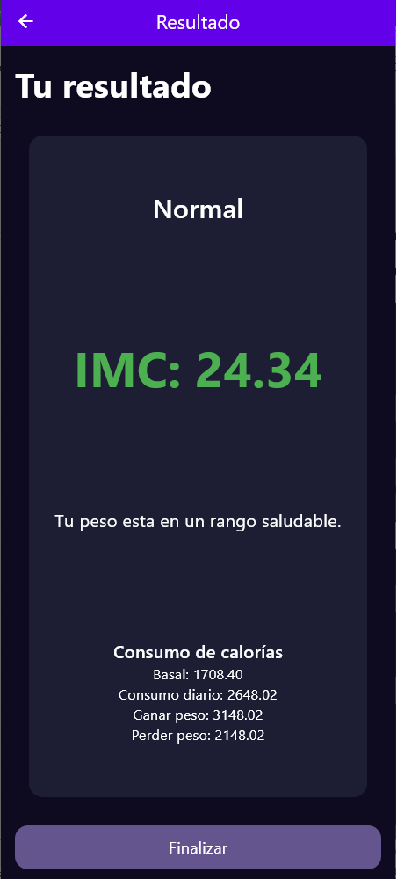
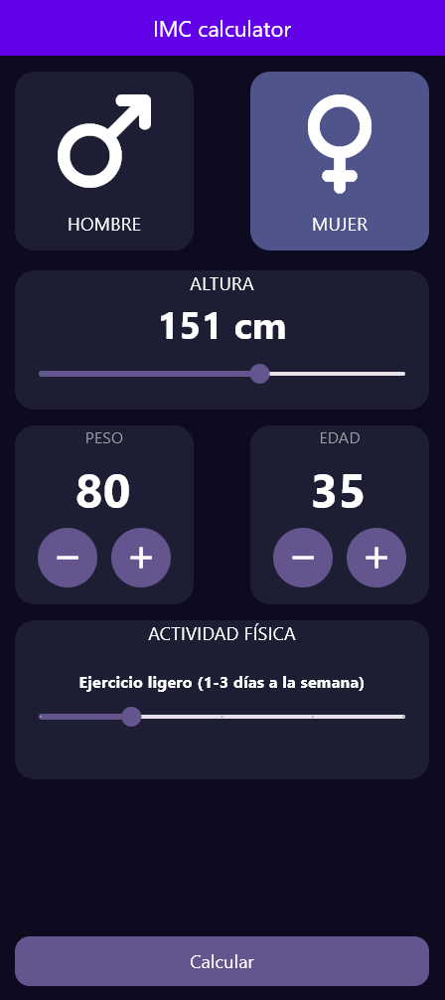
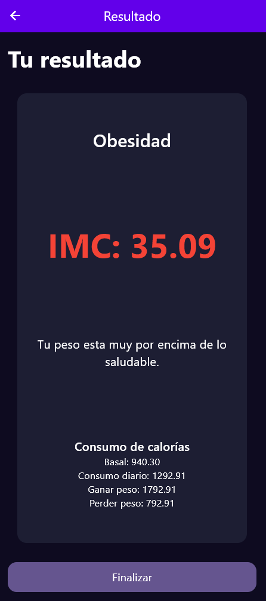

# 
IMC App

$${Hecho \space con \space \color{blue}Flutter}$$

Aplicación para el **cálculo del IMC**, incluyendo un apartado detallando el *consumo calórico* basado en la actividad física y las características de la persona 

*****
## <g>DEV</g>
Ningún paso extra es necesario

*****
## <pu>Stack</pu>
* Flutter

*****
## <pu>Dependecias usadas</pu>
* get

*****
## <lr>Imágenes</lr>

**Ejemplo masculino**

  
  

**Ejemplo femenino**

  
  

